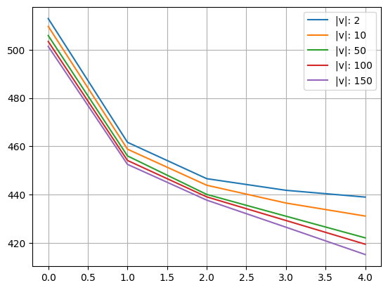
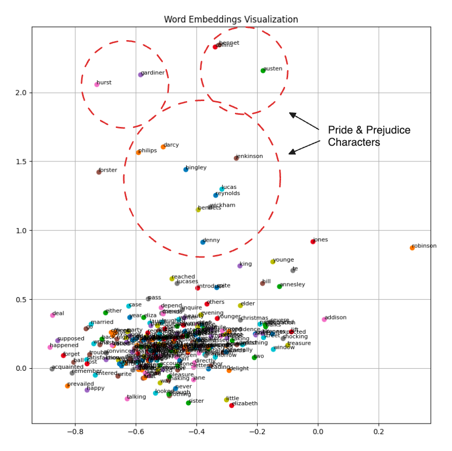

# w2v

Trying to understand how the meaning can be represented numerically,
so i decided to start with word2vec algorithm.

Building the model in multiple phases:

1. [basic.ipynb](basic.ipynb): Basic implementaiton for Word2Vec algorithm,
   in this notebook there's a simple implementation for encoding the corpus,
   preparing the data for training, forward pass, and backward pass. The objective behind
   *basic.ipynb* implementaion is for setting a starting point.
   
   

    - epochs: 250 (*small data*)
    - lr: 0.05
    - embedding_size: [2, 10, 30, 50, 100, 150, 300]
    - window_size: 2

 

2. [cbow.ipynb](cbow.ipynb): An implementation for Continous Bag of Word model,
    in this model we're trying to predict the center word based on the given context.
    it seems that if the model can be good at predicting the center word, that means
    it made a good representation for the words i.e. good embeddings.

    

    - corpus: [./cbow_corp_001.txt](./cbow_corp_001.txt) - Pride & Prejudice
    - epochs: 5
    - lr: 0.015
    - embedding_size: [2, 10, 50, 100, 150]
    - window_size: 2

    The model did capture the similarities between the different characters in the novel. Maybe with more playing would gain more pretty results.
    

### References
- [Efficient Estimation of Word Representations in Vector Space](https://arxiv.org/abs/1301.3781) (Mikolov Et al.)
   
   
### todos
- reduce model's loss (if it's possible)
- improve algorithm CBOW, Skip-Gram (more implementaions)
- Skip-Gram with Negatives
