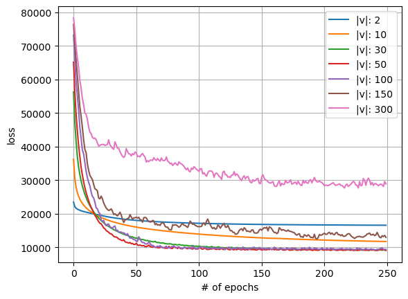

# w2v

Trying to understand how the meaning can be represented numerically,
so i decided to start with word2vec algorithm.

Building the model in multiple phases:

1. [basic.ipynb](basic.ipynb): Basic implementaiton for Word2Vec algorithm,
   in this notebook there's a simple implementation for encoding the corpus,
   preparing the data for training, forward pass, and backward pass. The objective behind
   *basic.ipynb* implementaion is for setting a starting point.
   
   
   
   
### todos
- use PCA to visualize the similarites between words
- reduce model's loss (if it's possible)
- improve algorithm CBOW, Skip-Gram (more implementaions)
- Skip-Gram with Negatives
